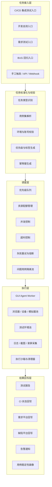
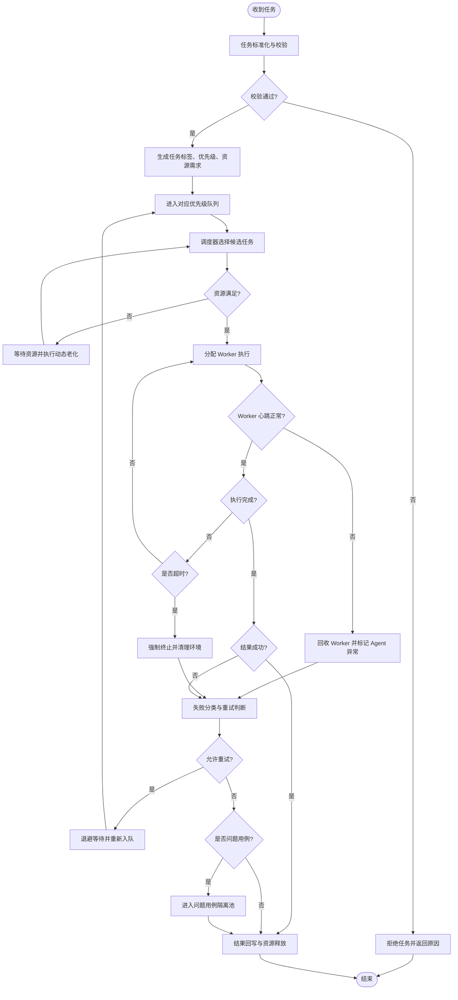

# 考题一：多场景调度引擎设计

## 1. 设计目标

面向 GUI Agent 的“用例执行调度引擎”需要同时承接四类任务：

- 集成测试大批量执行
- 开发自测
- 需求测试
- BUG 回归

核心目标是：在资源有限的情况下，让高优任务快速执行，让大批量任务稳定吞吐，让失败任务可控重试，并避免异常用例长期占用执行资源。

## 2. 整体架构



## 3. 分层说明

### 3.1 任务接入层

负责接收不同来源的执行请求，并保留任务上下文。

- 集成测试：通常由 CI/CD 流水线触发，任务量大，关注整体通过率和回归覆盖。
- 开发自测：通常由开发人员手动触发或提交代码后触发，关注反馈速度。
- 需求测试：通常绑定需求单、迭代计划或测试计划，关注覆盖范围和执行证据。
- BUG 回归：通常绑定缺陷单，关注指定问题是否修复，反馈优先级较高。

### 3.2 调度层

调度层是核心，主要解决“谁先跑、跑多少、跑多久、失败怎么办”。

关键能力包括：

- 多队列优先级调度
- 按任务类型分配资源配额
- 按环境、账号、设备、浏览器维度做并发限制
- 支持任务级、用例级、步骤级超时
- 支持失败重试、隔离、熔断、降级
- 支持问题用例画像，避免反复消耗资源

### 3.3 执行层

执行层由多个 GUI Agent Worker 组成，负责真正执行 GUI 自动化用例。

执行层需要具备：

- 独立运行沙箱，避免任务之间互相污染
- 执行前环境准备，执行后环境清理
- 实时日志、截图、录屏、DOM 快照采集
- 支持 Worker 心跳上报
- 支持异常任务强制终止

### 3.4 结果回写层

负责将执行结果同步给不同平台。

- CI/CD：回写流水线状态、失败摘要、报告链接。
- 需求平台：回写需求覆盖率、执行结果、测试证据。
- 缺陷平台：回写 BUG 回归状态、失败截图、日志。
- 测试平台：沉淀历史执行数据、稳定性数据和失败原因分类。

## 4. 四类任务的差异化调度策略

| 任务类型 | 优先级 | 资源配额 | 并发度 | 超时策略 | 核心目标 |
| --- | --- | --- | --- | --- | --- |
| BUG 回归 | 最高 | 预留小比例快速通道资源，例如 15% | 中等并发，优先抢占空闲 Worker | 单用例超时较短，快速判断修复是否有效 | 快速确认缺陷是否修复 |
| 开发自测 | 高 | 预留交互式资源，例如 20% | 中低并发，保证响应速度 | 总任务超时较短，失败快速返回 | 快速给开发反馈 |
| 需求测试 | 中 | 按迭代或项目动态分配，例如 25% | 中等并发，保证稳定性 | 根据用例复杂度配置弹性超时 | 支撑需求验收和证据沉淀 |
| 集成测试大批量执行 | 低到中 | 使用剩余主资源，例如 40% 以上 | 高并发，但受环境容量限制 | 总任务超时较长，允许批量分片执行 | 提升整体回归吞吐 |

### 4.1 优先级策略

建议采用“静态优先级 + 动态老化”的方式。

- 静态优先级：BUG 回归 > 开发自测 > 需求测试 > 集成测试。
- 动态老化：低优先级任务等待时间过长后，逐步提升调度权重。
- 快速通道：BUG 回归和开发自测进入轻量快速队列，避免被大批量集成测试淹没。

### 4.2 资源配额策略

资源配额不建议完全固定，应支持动态调整。

- 为 BUG 回归和开发自测保留基础资源，保证随时可跑。
- 集成测试可使用空闲资源，但不能挤占所有 Worker。
- 当需求测试进入验收高峰期时，可临时提高需求测试配额。
- 按环境、设备、账号维度设置上限，避免某类任务打满关键环境。

### 4.3 并发度策略

GUI Agent 任务通常依赖浏览器、模拟器、账号、测试环境，因此并发度不能只看 Worker 数量。

建议同时控制：

- 全局最大并发数
- 单任务类型最大并发数
- 单项目最大并发数
- 单环境最大并发数
- 单账号最大并发数
- 单用例最大重入数

### 4.4 超时策略

超时建议分三级：

- 步骤级超时：例如点击、输入、页面加载等待。
- 用例级超时：避免单条用例卡死。
- 任务级超时：避免整批任务无限运行。

不同任务类型可配置不同阈值：

- BUG 回归：短超时，快速反馈。
- 开发自测：短到中等超时，偏向快速失败。
- 需求测试：中等超时，保留更多证据采集时间。
- 集成测试：长超时，但必须按批次切片，避免单个大任务占用过久。

## 5. 失败重试、回滚与问题用例治理

### 5.1 失败分类

任务失败后，先分类再处理，不应无脑重试。

| 失败类型 | 示例 | 处理方式 |
| --- | --- | --- |
| 环境异常 | 环境不可用、服务 500、网络失败 | 可重试，必要时切换环境 |
| Agent 异常 | Worker 崩溃、浏览器挂死 | 可重试，回收 Worker |
| 数据异常 | 测试账号异常、测试数据污染 | 先回滚或重建数据，再重试 |
| 用例脚本异常 | 定位器失效、断言错误 | 限制重试，标记用例问题 |
| 产品缺陷 | 功能真实失败 | 不重复消耗资源，直接回写缺陷证据 |

### 5.2 重试策略

重试策略建议采用“分类重试 + 指数退避 + 最大次数限制”。

- 环境类失败：可重试 2 到 3 次，可换 Worker 或换环境。
- Agent 类失败：可重试 1 到 2 次，必须更换 Worker。
- 数据类失败：执行数据清理后重试 1 次。
- 脚本类失败：默认不重试或最多重试 1 次。
- 产品缺陷：不重试，直接记录失败证据。

### 5.3 回滚策略

GUI 自动化执行容易造成数据污染，因此需要在执行前后设计回滚机制。

推荐方式：

- 执行前创建测试数据快照或记录数据创建清单。
- 执行中所有数据变更写入操作日志。
- 执行失败后根据清单删除临时数据、恢复状态、释放账号锁。
- 对无法回滚的数据，使用一次性测试数据或隔离测试租户。
- Worker 异常退出时，由清理器根据心跳超时接管清理。

### 5.4 避免问题用例长期占用资源

问题用例包括长期失败、频繁超时、频繁导致 Worker 崩溃、重试后仍失败的用例。

治理手段：

- 熔断：同一用例连续失败超过阈值后，进入隔离池。
- 限流：问题用例降低优先级和并发度。
- 隔离执行：只允许在低峰期或专用 Worker 中执行。
- 失败画像：记录失败类型、失败时间、失败环境、失败截图。
- 自动降级：大批量集成测试中跳过已熔断用例，但报告中明确标记。
- 人工认领：将问题用例推送给用例负责人，修复前不占用主执行池。

## 6. 调度流程图



## 7. 核心调度伪代码

```pseudo
function submitTask(rawTask):
    task = normalize(rawTask)
    validate(task)

    task.priority = calculatePriority(task.type, task.businessImpact)
    task.quotaGroup = resolveQuotaGroup(task.type, task.project)
    task.timeoutPolicy = resolveTimeoutPolicy(task.type)
    task.idempotentKey = generateIdempotentKey(task)

    enqueue(task)


function scheduleLoop():
    while true:
        refreshResourceStatus()
        applyPriorityAging()

        candidateTasks = pickTasksByPriority()

        for task in candidateTasks:
            if isCircuitBroken(task.caseId):
                moveToQuarantinePool(task)
                continue

            if not hasEnoughQuota(task.quotaGroup):
                continue

            if not hasEnoughExecutionResource(task):
                continue

            worker = allocateWorker(task)
            lockResource(task.requiredEnv, task.requiredAccount)
            runAsync(worker, task)


function onTaskFinished(task, result):
    releaseResource(task)
    collectEvidence(task, result)

    if result.success:
        writeBack(task, result)
        updateCaseHealth(task.caseId, "success")
        return

    failureType = classifyFailure(result)
    updateCaseHealth(task.caseId, failureType)

    if shouldRollback(failureType):
        rollbackTestData(task)

    if shouldRetry(task, failureType):
        task.retryCount += 1
        task.nextRunTime = now + calculateBackoff(task.retryCount)
        requeue(task)
        return

    if shouldQuarantine(task.caseId):
        moveToQuarantinePool(task)

    writeBack(task, result)


function shouldRetry(task, failureType):
    if task.retryCount >= getMaxRetryCount(task.type, failureType):
        return false

    if failureType in ["PRODUCT_DEFECT", "SCRIPT_ASSERTION_FAILED"]:
        return false

    if isCircuitBroken(task.caseId):
        return false

    return true


function shouldQuarantine(caseId):
    health = getCaseHealth(caseId)

    if health.consecutiveTimeoutCount >= 3:
        return true

    if health.consecutiveFailureCount >= 5:
        return true

    if health.workerCrashCountIn24h >= 2:
        return true

    return false
```

## 8. 关键数据模型

```pseudo
Task {
    taskId
    taskType              // INTEGRATION, DEV_SELF_TEST, REQUIREMENT_TEST, BUG_REGRESSION
    projectId
    caseList
    priority
    quotaGroup
    requiredEnv
    requiredAccount
    timeoutPolicy
    retryCount
    maxRetryCount
    status
    submitter
    callbackTarget
}

TimeoutPolicy {
    stepTimeout
    caseTimeout
    taskTimeout
}

CaseHealth {
    caseId
    consecutiveFailureCount
    consecutiveTimeoutCount
    workerCrashCountIn24h
    lastFailureType
    isCircuitBroken
    owner
}
```

## 9. 总结

该调度引擎的核心不是简单地按提交顺序执行 GUI 自动化用例，而是围绕不同任务场景建立差异化策略：

- BUG 回归和开发自测强调快速反馈。
- 需求测试强调稳定执行和结果证据。
- 集成测试强调大批量吞吐和资源利用率。
- 失败任务需要先分类，再决定是否重试、回滚或隔离。
- 对问题用例必须建立熔断和隔离机制，避免持续消耗 GUI Agent 执行资源。

通过“优先级队列 + 资源配额 + 并发控制 + 超时治理 + 问题用例隔离”的组合，可以让 GUI Agent 调度引擎同时满足高优响应、批量吞吐和稳定运行的要求。
