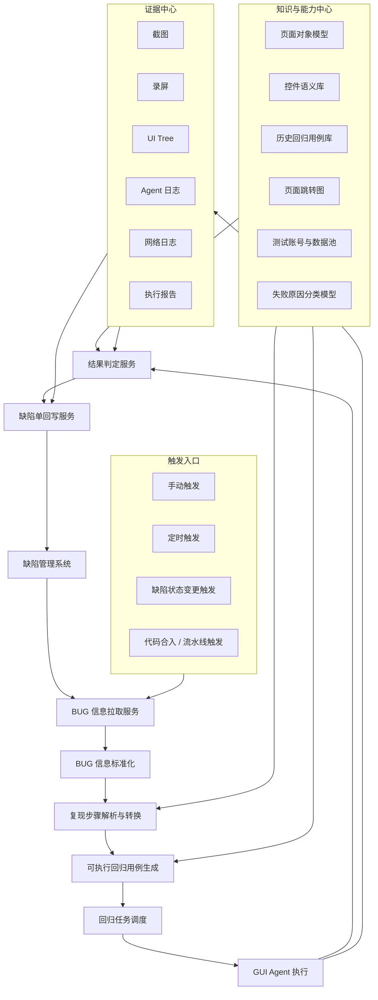
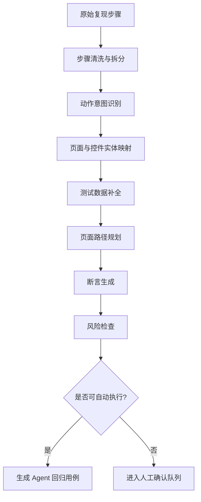
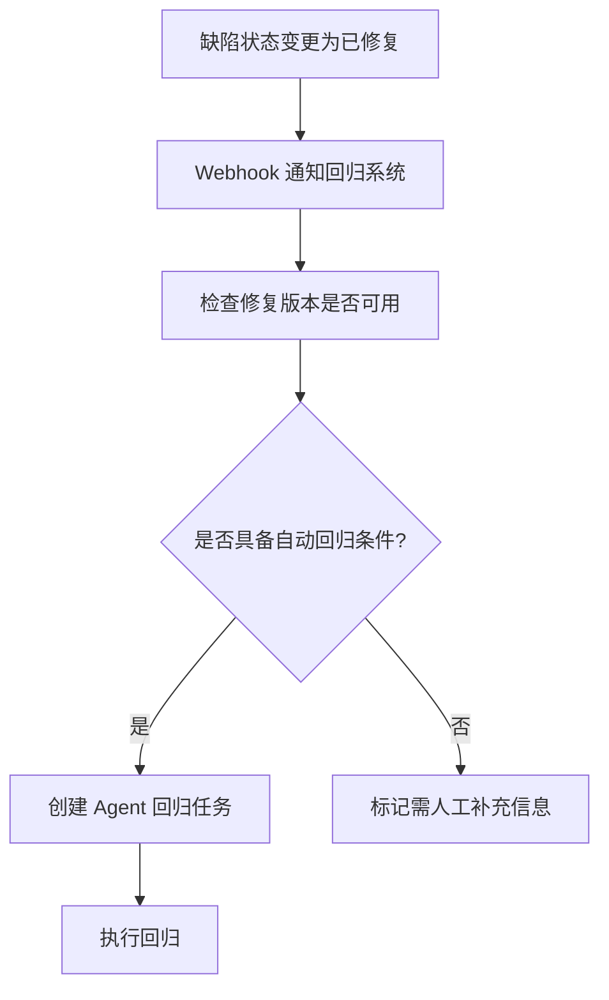
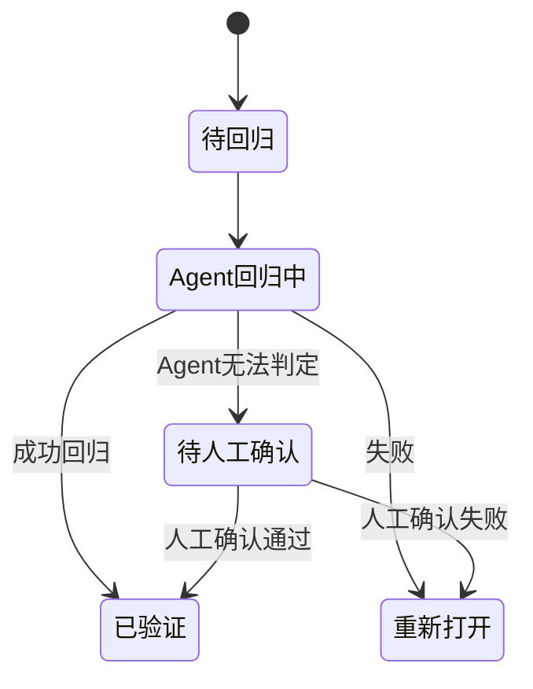

# 考题三：BUG 回归场景的端到端方案设计

## 1. 方案目标

BUG 回归场景的目标是：当缺陷被修复或需要验证时，系统能够自动从缺陷管理系统获取 BUG 信息，将“复现步骤”转换为 GUI Agent 可执行用例，自动完成回归验证，并将结果回写到缺陷单。

该方案关注的不只是“能跑自动化”，而是完整工程闭环：

- 缺陷信息接入
- 复现步骤结构化
- 可执行用例生成
- 回归任务触发
- Agent 执行与证据采集
- 三态结果判定
- 缺陷单自动回写
- 效果度量与持续优化

## 2. 端到端架构



## 3. 从缺陷管理系统拉取 BUG 信息

### 3.1 接入方式

缺陷管理系统可以是 TAPD、Jira、禅道、飞书项目、内部缺陷平台等。建议通过统一的 Defect Adapter 接入，屏蔽不同平台字段差异。

常见拉取方式：

- API 拉取：按缺陷 ID、项目、迭代、状态查询。
- Webhook 推送：缺陷状态变化时由缺陷系统主动通知。
- 定时扫描：周期性扫描待回归缺陷。
- 流水线关联：研发合入修复分支后，根据 commit 或 MR 中关联的 BUG ID 拉取缺陷。

### 3.2 拉取字段

建议至少拉取以下字段：

| 字段 | 说明 | 用途 |
| --- | --- | --- |
| bugId | 缺陷唯一 ID | 幂等与回写 |
| title | 缺陷标题 | 生成回归用例名称 |
| description | 缺陷描述 | 辅助理解问题 |
| reproduceSteps | 复现步骤 | 转换为可执行步骤 |
| expectedResult | 期望结果 | 生成断言 |
| actualResult | 实际结果 | 明确缺陷表现 |
| severity | 严重级别 | 调度优先级 |
| status | 缺陷状态 | 判断是否需要回归 |
| assignee | 负责人 | 失败或无法判定时通知 |
| module | 所属模块 | 选择页面模型和环境 |
| appVersion | 发现版本 | 判断复现环境 |
| fixedVersion | 修复版本 | 选择回归包 |
| attachments | 图片、视频、日志 | 辅助定位和判定 |
| environment | 设备、系统、账号、网络 | 构建执行环境 |

### 3.3 标准化后的 BUG 模型

```pseudo
BugInfo {
    bugId
    title
    module
    severity
    status
    assignee
    appVersion
    fixedVersion
    environment
    reproduceSteps[]
    expectedResult
    actualResult
    attachments[]
    sourceUrl
}
```

## 4. 复现步骤转换为可执行用例

### 4.1 转换流程



### 4.2 转换要点

缺陷单中的复现步骤通常不如测试用例规范，可能存在口语化、缺步骤、截图代替文字、断言不明确等情况。转换时需要结合标题、实际结果、期望结果和附件一起理解。

处理原则：

- 优先使用缺陷单中的“复现步骤”生成操作步骤。
- 使用“期望结果”生成成功回归断言。
- 使用“实际结果”生成缺陷复现断言，用于判断是否仍失败。
- 使用附件截图、视频辅助识别页面和控件。
- 对缺失的登录、环境、测试数据进行自动补全。
- 对高风险操作或无法解析步骤进入人工确认。

### 4.3 示例

原始 BUG 信息：

```text
BUG 标题：关闭通知后重新进入设置页，通知开关又变成开启
复现步骤：
1. 登录账号
2. 进入我的-设置
3. 关闭通知开关
4. 返回我的页面，再次进入设置
实际结果：通知开关重新变成开启
期望结果：通知开关保持关闭
```

转换后的中间表示：

```json
{
  "bugId": "BUG-1024",
  "caseName": "回归 BUG-1024：通知开关关闭状态应保留",
  "source": "defect",
  "preconditions": [
    {
      "type": "login",
      "accountPool": "normal_user_pool"
    }
  ],
  "steps": [
    {
      "action": "navigate",
      "targetPage": "SettingsPage",
      "path": ["HomePage", "ProfilePage", "SettingsPage"]
    },
    {
      "action": "set_switch",
      "page": "SettingsPage",
      "target": "NotificationSwitch",
      "value": false
    },
    {
      "action": "back",
      "targetPage": "ProfilePage"
    },
    {
      "action": "navigate",
      "targetPage": "SettingsPage",
      "path": ["ProfilePage", "SettingsPage"]
    }
  ],
  "assertions": [
    {
      "type": "state_equals",
      "page": "SettingsPage",
      "target": "NotificationSwitch",
      "expected": false
    }
  ],
  "evidenceRequired": ["screenshot", "ui_tree", "screen_record"]
}
```

最终交给 GUI Agent 的输入：

```json
{
  "agentTaskId": "REGRESSION_BUG_1024",
  "bugId": "BUG-1024",
  "name": "回归 BUG-1024：通知开关关闭状态应保留",
  "priority": "P0_FAST_LANE",
  "environment": {
    "appVersion": "fixedVersion",
    "platform": "android",
    "devicePool": "stable_regression_devices"
  },
  "policy": {
    "caseTimeoutMs": 60000,
    "stepTimeoutMs": 10000,
    "maxRetry": 1,
    "retryOn": ["PAGE_LOAD_TIMEOUT", "ELEMENT_NOT_FOUND", "AGENT_RUNTIME_ERROR"]
  },
  "steps": [
    {
      "id": "S1",
      "action": "login",
      "using": "normal_user_pool",
      "expect": {
        "page": "HomePage"
      }
    },
    {
      "id": "S2",
      "action": "tap",
      "target": {
        "strategy": "accessibility_id",
        "value": "tab_profile"
      },
      "expect": {
        "page": "ProfilePage"
      }
    },
    {
      "id": "S3",
      "action": "tap",
      "target": {
        "strategy": "accessibility_id",
        "value": "entry_settings"
      },
      "expect": {
        "page": "SettingsPage"
      }
    },
    {
      "id": "S4",
      "action": "set_switch",
      "target": {
        "strategy": "accessibility_id",
        "value": "notification_switch"
      },
      "value": false,
      "expect": {
        "type": "state_equals",
        "value": false
      }
    },
    {
      "id": "S5",
      "action": "back",
      "expect": {
        "page": "ProfilePage"
      }
    },
    {
      "id": "S6",
      "action": "tap",
      "target": {
        "strategy": "accessibility_id",
        "value": "entry_settings"
      },
      "expect": {
        "page": "SettingsPage"
      }
    },
    {
      "id": "A1",
      "action": "assert",
      "target": {
        "strategy": "accessibility_id",
        "value": "notification_switch"
      },
      "assertion": {
        "type": "state_equals",
        "expected": false
      },
      "evidence": ["screenshot", "ui_tree", "screen_record"]
    }
  ]
}
```

## 5. 回归任务触发方式

### 5.1 手动触发

适用场景：

- 测试人员在缺陷单详情页点击“Agent 回归”。
- 研发修复后希望立即验证。
- 对某个高优缺陷进行单独回归。

流程：


### 5.2 定时触发

适用场景：

- 每天固定时间扫描“待回归”缺陷。
- 夜间批量回归低优或普通缺陷。
- 版本发布前批量回归未关闭缺陷。

策略：

- 按项目、版本、状态扫描缺陷。
- 对高优缺陷优先执行。
- 对历史无法判定的缺陷限制重试次数。
- 对长期缺少有效复现步骤的缺陷打标并提醒补充信息。

### 5.3 缺陷状态变更触发

适用场景：

- 缺陷状态从“修复中”变为“已修复”。
- 修复分支合入目标分支。
- 缺陷绑定的构建包完成。

流程：



### 5.4 代码合入或流水线触发

适用场景：

- commit message 或 MR 描述中包含 BUG ID。
- 修复分支构建完成后自动回归关联 BUG。
- CI 成功后触发轻量回归。

该方式可以让“修复代码 -> 构建完成 -> 自动回归 -> 回写缺陷单”形成快速闭环。

## 6. 回归结果三态判定

BUG 回归不能只有成功或失败，还需要支持 Agent 无法判定。推荐三态模型：

| 状态 | 含义 | 示例 |
| --- | --- | --- |
| 成功回归 | Agent 执行完成，期望断言通过，缺陷现象未复现 | 通知开关重新进入后仍为关闭 |
| 失败 | Agent 执行完成，但缺陷仍复现或期望断言失败 | 通知开关重新进入后变为开启 |
| Agent 无法判定 | Agent 未能可靠完成执行或断言证据不足 | 页面结构变化、控件找不到、环境异常、复现步骤缺失 |

### 6.1 成功回归判定

满足条件：

- 所有关键步骤执行成功。
- 页面跳转符合预期。
- 期望断言通过。
- 未出现缺陷单中描述的实际结果。
- 证据完整，包括截图、UI Tree、执行日志。

回写建议：

```text
Agent 回归结果：成功回归
执行版本：x.x.x
执行设备：Android xx
执行时间：2026-06-18 17:30
结论：按缺陷复现步骤执行后，通知开关保持关闭，未复现原问题。
证据：报告链接、截图、录屏
```

### 6.2 失败判定

满足条件：

- Agent 成功执行到断言点。
- 实际结果与期望结果不一致。
- 缺陷现象与原始 actualResult 一致或高度相似。

回写建议：

```text
Agent 回归结果：失败
结论：缺陷仍可复现。重新进入设置页后，通知开关状态为开启，期望为关闭。
失败步骤：A1
证据：失败截图、UI Tree、录屏、日志
建议：请研发继续修复。
```

### 6.3 Agent 无法判定

满足任一条件：

- 复现步骤无法解析成稳定动作。
- 页面或控件找不到，且重试后仍失败。
- 测试环境不可用。
- 账号或测试数据不可用。
- 断言点不明确。
- Agent 执行过程异常中断。
- 证据不足以判断缺陷是否修复。

回写建议：

```text
Agent 回归结果：Agent 无法判定
原因：无法在设置页定位“通知开关”，疑似页面结构变化或控件标识缺失。
已执行步骤：登录成功 -> 进入我的页 -> 进入设置页失败
需要人工处理：请补充复现路径或维护控件定位信息。
证据：截图、UI Tree、日志
```

## 7. 回写缺陷单设计

### 7.1 回写字段

建议回写以下信息：

| 字段 | 内容 |
| --- | --- |
| agentRegressionStatus | 成功回归 / 失败 / Agent 无法判定 |
| agentRegressionTime | 回归时间 |
| agentRegressionVersion | 回归版本 |
| agentRegressionEnv | 设备、系统、网络、账号类型 |
| agentRegressionSummary | 简要结论 |
| agentFailureReason | 失败或无法判定原因 |
| reportUrl | 执行报告链接 |
| evidenceUrls | 截图、录屏、日志链接 |
| agentCaseId | 生成的 Agent 用例 ID |

### 7.2 状态流转建议



### 7.3 回写幂等与防重复

回写服务需要保证幂等：

- 同一个 bugId + fixedVersion + agentCaseId 只保留一条最终结果。
- 重复触发时更新同一条回归记录，不重复刷评论。
- 每次执行保留独立报告，但缺陷单只展示最新有效结论。
- 若人工已修改缺陷状态，Agent 回写前需要二次检查状态，避免覆盖人工结论。

## 8. 执行策略与异常治理

### 8.1 优先级

BUG 回归应进入快速通道：

- P0/P1 缺陷优先执行。
- 阻塞发布的缺陷优先执行。
- 与当前构建版本匹配的缺陷优先执行。
- 多次无法判定的缺陷降低自动执行优先级，避免反复消耗资源。

### 8.2 重试策略

| 失败类型 | 是否重试 | 策略 |
| --- | --- | --- |
| 页面加载超时 | 是 | 换 Worker 重试 1 次 |
| 控件偶发找不到 | 是 | 刷新页面或重新进入后重试 1 次 |
| 环境不可用 | 是 | 切换环境或延迟重试 |
| 断言失败 | 否 | 直接判定为失败 |
| 复现步骤无法解析 | 否 | 判定为 Agent 无法判定 |
| 页面结构变化 | 有条件 | 若存在备用定位可重试，否则无法判定 |

### 8.3 风险控制

- 对删除、支付、权限变更等高风险步骤默认要求人工确认。
- 对无法回滚的数据操作使用测试租户或隔离环境。
- 对连续无法判定的 BUG 打标，不再频繁自动触发。
- 对经常误报的模块建立专项规则或补充页面对象模型。

## 9. 有效性度量

BUG 回归方向的有效性不能只看“执行了多少条”，还要看是否真正替代人工、是否可信、是否提升效率。

### 9.1 覆盖与替代类指标

| 指标 | 计算方式 | 含义 |
| --- | --- | --- |
| 可自动转换率 | 可生成 Agent 用例的 BUG 数 / 待回归 BUG 数 | 衡量缺陷步骤结构化能力 |
| 自动回归执行率 | Agent 实际执行 BUG 数 / 待回归 BUG 数 | 衡量自动化覆盖面 |
| 人工回归被替代率 | Agent 成功给出可信结论的 BUG 数 / 原本需要人工回归 BUG 数 | 衡量人力节省 |
| 高优 BUG 覆盖率 | P0/P1 自动回归 BUG 数 / P0/P1 待回归 BUG 数 | 衡量关键场景价值 |

### 9.2 准确性指标

| 指标 | 计算方式 | 含义 |
| --- | --- | --- |
| 误报率 | Agent 判定失败但人工确认通过的数量 / Agent 判定失败数量 | 衡量错误拦截 |
| 漏报率 | Agent 判定成功但人工或线上发现仍失败的数量 / Agent 判定成功数量 | 衡量错误放行 |
| 无法判定率 | Agent 无法判定数量 / Agent 执行数量 | 衡量可执行性和断言质量 |
| 断言命中率 | 成功执行到断言点的任务数 / Agent 执行任务数 | 衡量路径和控件稳定性 |

### 9.3 效率指标

| 指标 | 计算方式 | 含义 |
| --- | --- | --- |
| 平均回归耗时 | 从触发到回写完成的平均时间 | 衡量反馈速度 |
| 人工节省时长 | 被替代 BUG 数 * 平均人工回归耗时 | 量化人效收益 |
| 修复反馈周期缩短率 | 自动回归周期相比人工回归周期的下降比例 | 衡量研发反馈效率 |
| 夜间回归完成率 | 夜间成功完成的回归数 / 夜间计划回归数 | 衡量无人值守能力 |

### 9.4 稳定性指标

| 指标 | 计算方式 | 含义 |
| --- | --- | --- |
| Agent 执行成功率 | 非环境、非 Agent 异常完成数 / 执行总数 | 衡量执行链路稳定性 |
| 控件定位失败率 | 控件定位失败次数 / 总定位次数 | 衡量页面对象模型质量 |
| 环境失败率 | 环境异常次数 / 执行总数 | 衡量环境可靠性 |
| 重试成功率 | 重试后成功完成任务数 / 重试任务数 | 衡量重试策略价值 |

## 10. 运营闭环

为了持续提升 BUG 回归有效性，需要建立运营机制：

- 每日统计无法判定 TOP 原因。
- 每周治理高频定位失败控件。
- 对高价值 BUG 复现步骤沉淀为标准回归用例。
- 对误报和漏报进行人工复盘，修正断言规则。
- 将成功转换的 BUG 回归用例加入长期回归集。
- 将缺陷单书写质量纳入团队规范，例如必须填写清晰复现步骤和期望结果。

## 11. 核心伪代码

```pseudo
function handleBugRegressionTrigger(trigger):
    bugInfo = defectAdapter.fetchBug(trigger.bugId)
    normalizedBug = normalizeBugInfo(bugInfo)

    if not isRegressionNeeded(normalizedBug):
        return skip("bug status or version is not eligible")

    convertResult = convertReproduceStepsToAgentCase(normalizedBug)

    if convertResult.status == "NEED_CONFIRMATION":
        writeBackUnableToJudge(
            bugId = normalizedBug.bugId,
            reason = convertResult.reason,
            evidence = convertResult.parseReport
        )
        return

    task = createRegressionTask(
        bug = normalizedBug,
        agentCase = convertResult.agentCase,
        priority = calculateBugPriority(normalizedBug)
    )

    executeResult = guiAgent.run(task)
    judgment = judgeRegressionResult(normalizedBug, executeResult)

    writeBackRegressionResult(normalizedBug.bugId, judgment, executeResult.evidence)


function judgeRegressionResult(bug, executeResult):
    if executeResult.status in ["ENV_ERROR", "AGENT_ERROR", "CASE_PARSE_ERROR"]:
        return {
            "state": "AGENT_UNABLE_TO_JUDGE",
            "reason": executeResult.failureReason
        }

    if not executeResult.reachedAssertion:
        return {
            "state": "AGENT_UNABLE_TO_JUDGE",
            "reason": "assertion point not reached"
        }

    if executeResult.assertionPassed:
        return {
            "state": "REGRESSION_PASSED",
            "summary": "expected result matched, bug symptom not reproduced"
        }

    if isSimilarToOriginalActualResult(executeResult.actual, bug.actualResult):
        return {
            "state": "REGRESSION_FAILED",
            "summary": "bug symptom reproduced"
        }

    return {
        "state": "REGRESSION_FAILED",
        "summary": "expected result not matched"
    }
```

## 12. 总结

BUG 回归的端到端方案，关键不在于单次 Agent 执行，而在于形成“缺陷系统接入 -> 复现步骤转换 -> 自动执行 -> 三态判定 -> 缺陷单回写 -> 指标运营”的闭环。

该方向要特别重视三点：

- 可执行性：复现步骤必须转换成结构化、可定位、可断言的 Agent 用例。
- 可信性：结果必须有明确证据，且区分成功、失败、无法判定。
- 有效性：用人工替代率、误报率、漏报率、无法判定率等指标持续衡量真实价值。

最终目标是让 BUG 回归从依赖人工重复验证，演进为可触发、可执行、可判定、可追溯、可持续优化的工程化能力。
