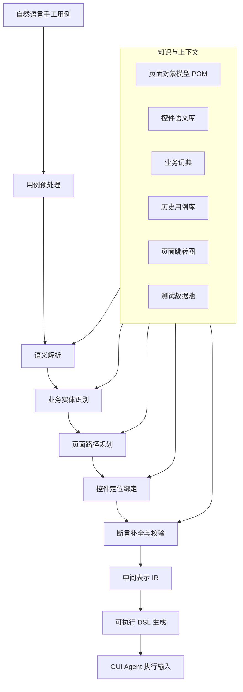

# 考题二：自然语言手工用例到 Agent 可执行用例的转换方案

## 1. 设计目标

现有手工用例通常以自然语言描述，例如：

> 登录后进入“我的”页面，点击“设置”，关闭通知开关，验证开关状态保留。

这类描述适合人工理解，但不适合 GUI Agent 稳定执行。转换方案的目标是将自然语言用例转成结构化、可校验、可回放、可诊断的步骤序列。

核心目标包括：

- 将自然语言拆解成明确的操作步骤和断言步骤。
- 将页面、控件、动作、数据、断言转成结构化中间表示。
- 通过页面模型、控件库、业务词典和历史执行数据消除歧义。
- 对不明确内容进行补全、澄清或标记为待人工确认。
- 最终生成 GUI Agent 可执行输入，例如 JSON DSL、动作序列或任务计划。

## 2. 工程实现概览

本题已落地为一个本地可运行的完整工程，目录为：

```text
manual-case-to-agent-demo/
```

工程目标与本方案保持一致：输入自然语言手工用例，输出可供 GUI Agent 执行的结构化 JSON DSL，同时保留中间表示 IR、解析意图和风险提示。

实际工程结构如下：

```text
manual-case-to-agent-demo/
  convert_manual_case.py              命令行入口
  run_converter.ps1                   Windows 运行脚本
  README.md                           中文说明文档

  manual_case_agent/
    schema.py                         数据结构定义
    text_utils.py                     文本清洗与拆句
    page_model.py                     页面模型、控件库、路径规划
    intent_parser.py                  自然语言动作意图识别
    ir_builder.py                     中间表示 IR 构建
    agent_dsl.py                      GUI Agent DSL 生成
    converter.py                      完整 pipeline 编排

  data/
    page_model.json                   页面对象模型、控件语义库、页面跳转图
    manual_cases/                     多个自然语言手工用例样例

  output/                             转换后的 JSON 输出
```

工程实现的核心 pipeline：

```text
自然语言手工用例
  -> 句子拆分
  -> 动作意图识别
  -> 页面 / 控件实体绑定
  -> 页面路径规划
  -> 断言补全
  -> 中间表示 IR
  -> GUI Agent DSL JSON
```

已提供测试样例：

| 样例文件 | 场景 | 预期效果 |
| --- | --- | --- |
| `notification_switch_persist.txt` | 通知开关状态保留 | 正常生成步骤和状态断言 |
| `coupon_receive_success.txt` | 优惠券领取成功 | 生成领取步骤和展示断言 |
| `refund_apply_success.txt` | 退款申请成功 | 生成退款路径和退款状态断言 |
| `login_captcha_boundary.txt` | 登录验证码边界 | 生成输入、点击和验证码展示断言 |
| `ambiguous_assertion.txt` | 模糊断言 | 输出风险，提示需要人工补充断言 |

实际验证结果：

| 样例 | 意图数 | IR 步骤数 | 断言数 | 风险数 |
| --- | ---: | ---: | ---: | ---: |
| 通知开关状态保留 | 7 | 5 | 1 | 0 |
| 优惠券领取成功 | 4 | 2 | 1 | 0 |
| 退款申请成功 | 7 | 5 | 1 | 0 |
| 登录验证码边界 | 5 | 4 | 1 | 0 |
| 模糊断言 | 5 | 3 | 0 | 1 |

运行方式：

```powershell
cd manual-case-to-agent-demo
powershell -ExecutionPolicy Bypass -File .\run_converter.ps1
```

也可以通过命令行指定测试文件：

```bash
python convert_manual_case.py --case data/manual_cases/refund_apply_success.txt --out output/refund_apply_success.json --case-id TC_REFUND_001 --title 退款申请成功
```

## 3. 整体转换架构



## 4. 转换流程

### 4.1 用例预处理

将原始手工用例做标准化处理。

主要动作：

- 去除无效符号和口语化噪声。
- 拆分复合句，例如“登录后进入我的页面”拆成“完成登录”和“进入我的页面”。
- 识别前置条件、操作步骤、预期结果。
- 补齐缺省主语，例如“点击设置”补为“在当前页面点击设置入口”。

### 4.2 语义解析

将句子解析为动作、对象、参数和期望。

常见结构如下：

```pseudo
StepIntent {
    action       // click, input, switch, navigate, assert
    target       // 设置、通知开关、我的页面
    value        // 关闭、开启、用户名、密码
    condition    // 登录后、返回后、重新进入页面后
    expectation  // 状态保留、页面展示成功、提示出现
}
```

示例：

| 原始表达 | 解析结果 |
| --- | --- |
| 点击“设置” | action=click, target=设置 |
| 关闭通知开关 | action=switch, target=通知开关, value=off |
| 验证开关状态保留 | action=assert, target=通知开关, expectation=state_persisted |

### 4.3 业务实体识别

将自然语言中的业务词映射到系统中的真实页面、控件和数据。

示例：

| 自然语言词 | 标准实体 | 类型 |
| --- | --- | --- |
| 我的 | ProfilePage | 页面 |
| 设置 | SettingsEntry / SettingsPage | 入口或页面 |
| 通知开关 | NotificationSwitch | 控件 |
| 关闭 | false / off | 控件值 |
| 状态保留 | persistence assertion | 断言类型 |

### 4.4 页面路径规划

手工用例经常省略中间路径，例如“进入我的页面，点击设置”。GUI Agent 需要知道如何到达目标页面。

因此需要维护页面跳转图：


路径规划示例：

```pseudo
current = HomePage
target = SettingsPage
path = findShortestPath(pageGraph, current, target)

// path = HomePage -> ProfilePage -> SettingsPage
```

### 4.5 控件定位绑定

自然语言中的“设置”“通知开关”不能直接执行，需要绑定到稳定定位策略。

推荐控件定位优先级：

1. 唯一测试标识，例如 `data-testid`、`accessibility_id`。
2. 稳定语义属性，例如 `aria-label`、控件文本、控件角色。
3. 页面对象模型中的业务别名。
4. 视觉定位，例如 OCR 文本、图标模板、相对位置。
5. 坐标兜底，但只作为最后选择。

控件绑定结果示例：

```json
{
  "entity": "NotificationSwitch",
  "page": "SettingsPage",
  "locator": {
    "strategy": "accessibility_id",
    "value": "notification_switch"
  },
  "fallbackLocators": [
    {
      "strategy": "text_near_role",
      "text": "通知",
      "role": "switch"
    },
    {
      "strategy": "vision",
      "description": "设置页中通知文案右侧的开关"
    }
  ]
}
```

## 5. 模糊问题处理

### 4.1 模糊表达处理

常见模糊表达包括：

- “进入相关页面”
- “点击按钮”
- “验证成功”
- “状态正常”
- “稍等一会”
- “返回后还是一样”

处理思路：

| 模糊类型 | 示例 | 处理方式 |
| --- | --- | --- |
| 页面不明确 | 进入相关页面 | 根据上下文、历史用例、页面跳转图推断；无法推断则要求人工确认 |
| 控件不明确 | 点击按钮 | 根据当前页面候选控件、动作上下文排序；多候选时标记歧义 |
| 等待不明确 | 稍等一会 | 转成显式等待条件，例如等待页面加载完成或元素可见 |
| 结果不明确 | 验证成功 | 根据动作推断默认断言，例如 toast 出现、页面跳转、状态变化 |
| 状态不明确 | 状态正常 | 转成具体字段、控件值或接口状态；无法转换则阻断执行 |

模糊表达不能直接下发给 Agent。必须经过以下三种处理之一：

- 自动补全：系统有足够上下文时自动推断。
- 人工确认：候选结果多个且风险较高时要求确认。
- 阻断转换：关键信息缺失，不能生成稳定用例。

### 4.2 跨页面跳转处理

跨页面跳转的问题在于：手工用例经常省略“怎么过去”。

解决方式：

- 建立页面跳转图，记录页面之间的入口控件。
- 每个页面维护唯一页面特征，例如标题、关键控件、URL、Activity 名。
- 执行过程中每次跳转后都进行页面断言。
- 如果跳转失败，Agent 不继续盲目点击，而是执行恢复策略。

页面跳转步骤示例：

```json
{
  "action": "navigate",
  "from": "HomePage",
  "to": "SettingsPage",
  "path": [
    {
      "page": "HomePage",
      "action": "click",
      "target": "ProfileTab"
    },
    {
      "page": "ProfilePage",
      "action": "click",
      "target": "SettingsEntry"
    }
  ],
  "assertEachPage": true
}
```

### 4.3 断言点不明确处理

断言不明确是自然语言用例转换中最容易导致误判的问题。

例如“验证开关状态保留”，需要明确：

- 保留在哪个场景后？
- 保留什么状态？
- 到哪个页面验证？
- 验证哪个控件？
- 判断依据是 UI 状态、接口返回还是本地缓存？

处理规则：

- 操作类步骤必须有后置可观测结果。
- 状态类断言必须明确目标对象和期望值。
- 持久化类断言必须包含“改变状态 -> 离开页面或重启 -> 再进入页面 -> 验证状态”。
- 页面类断言必须明确页面唯一特征。
- 如果断言目标缺失，应根据前序操作自动生成默认断言。

示例：

| 原始断言 | 补全后的断言 |
| --- | --- |
| 验证成功 | 验证页面出现“保存成功”提示，且通知开关为关闭状态 |
| 验证状态保留 | 重新进入设置页后，验证通知开关仍为关闭 |
| 验证进入我的页面 | 验证页面标题为“我的”，且存在设置入口 |

## 6. 中间表示设计

中间表示用于承接自然语言解析结果，并在生成 Agent 输入前做校验。

```pseudo
TestCaseIR {
    caseId
    title
    preconditions[]
    steps[]
    assertions[]
    dataRequirements[]
    riskFlags[]
}

IRStep {
    stepId
    intent             // navigate, click, input, switch, assert, wait
    page
    target
    value
    locator
    waitCondition
    timeout
    retryPolicy
    sourceText
}

IRAssertion {
    assertionId
    page
    target
    type               // visible, value_equals, state_equals, persisted
    expected
    evidence           // screenshot, dom_snapshot, log
}
```

## 7. 端到端示例

### 6.1 输入用例

```text
登录后进入“我的”页面，点击“设置”，关闭通知开关，验证开关状态保留。
```

### 6.2 解析后的动作意图

```json
{
  "title": "关闭通知开关后状态保留",
  "preconditions": [
    {
      "type": "login",
      "account": "normal_user"
    }
  ],
  "intents": [
    {
      "action": "navigate",
      "target": "我的页面",
      "sourceText": "登录后进入“我的”页面"
    },
    {
      "action": "click",
      "target": "设置",
      "sourceText": "点击“设置”"
    },
    {
      "action": "switch",
      "target": "通知开关",
      "value": "off",
      "sourceText": "关闭通知开关"
    },
    {
      "action": "assert",
      "target": "通知开关",
      "expectation": "state_persisted",
      "sourceText": "验证开关状态保留"
    }
  ]
}
```

### 6.3 转换后的中间表示 IR

```json
{
  "caseId": "TC_PROFILE_SETTING_001",
  "title": "关闭通知开关后状态保留",
  "preconditions": [
    {
      "type": "login",
      "accountPool": "normal_user_pool",
      "assert": {
        "page": "HomePage",
        "target": "HomeTab",
        "type": "visible"
      }
    }
  ],
  "steps": [
    {
      "stepId": "S1",
      "intent": "navigate",
      "page": "HomePage",
      "target": "ProfilePage",
      "path": [
        {
          "action": "click",
          "page": "HomePage",
          "target": "ProfileTab",
          "locator": {
            "strategy": "accessibility_id",
            "value": "tab_profile"
          }
        }
      ],
      "waitCondition": {
        "page": "ProfilePage",
        "target": "SettingsEntry",
        "type": "visible"
      },
      "timeout": 10000
    },
    {
      "stepId": "S2",
      "intent": "click",
      "page": "ProfilePage",
      "target": "SettingsEntry",
      "locator": {
        "strategy": "accessibility_id",
        "value": "entry_settings"
      },
      "waitCondition": {
        "page": "SettingsPage",
        "target": "NotificationSwitch",
        "type": "visible"
      },
      "timeout": 10000
    },
    {
      "stepId": "S3",
      "intent": "switch",
      "page": "SettingsPage",
      "target": "NotificationSwitch",
      "value": false,
      "locator": {
        "strategy": "accessibility_id",
        "value": "notification_switch"
      },
      "postAssert": {
        "type": "state_equals",
        "expected": false
      },
      "timeout": 5000
    },
    {
      "stepId": "S4",
      "intent": "navigate",
      "page": "SettingsPage",
      "target": "ProfilePage",
      "path": [
        {
          "action": "back",
          "page": "SettingsPage"
        }
      ],
      "timeout": 5000
    },
    {
      "stepId": "S5",
      "intent": "click",
      "page": "ProfilePage",
      "target": "SettingsEntry",
      "locator": {
        "strategy": "accessibility_id",
        "value": "entry_settings"
      },
      "waitCondition": {
        "page": "SettingsPage",
        "target": "NotificationSwitch",
        "type": "visible"
      },
      "timeout": 10000
    }
  ],
  "assertions": [
    {
      "assertionId": "A1",
      "page": "SettingsPage",
      "target": "NotificationSwitch",
      "type": "state_equals",
      "expected": false,
      "evidence": [
        "screenshot",
        "ui_tree"
      ]
    }
  ],
  "riskFlags": []
}
```

### 6.4 最终交给 GUI Agent 的输入

```json
{
  "agentTaskId": "AGENT_TC_PROFILE_SETTING_001",
  "name": "关闭通知开关后状态保留",
  "environment": {
    "platform": "android",
    "app": "target_app",
    "resetBeforeRun": false
  },
  "data": {
    "accountPool": "normal_user_pool"
  },
  "executionPolicy": {
    "stepTimeoutMs": 10000,
    "caseTimeoutMs": 60000,
    "retry": {
      "maxRetry": 1,
      "retryOn": [
        "ELEMENT_NOT_FOUND",
        "PAGE_LOAD_TIMEOUT",
        "AGENT_RUNTIME_ERROR"
      ]
    },
    "evidence": [
      "screenshot_on_each_step",
      "ui_tree_on_failure",
      "screen_record"
    ]
  },
  "steps": [
    {
      "id": "S0",
      "action": "login",
      "using": "normal_user_pool",
      "expect": {
        "page": "HomePage",
        "visible": {
          "strategy": "accessibility_id",
          "value": "tab_home"
        }
      }
    },
    {
      "id": "S1",
      "action": "tap",
      "target": {
        "strategy": "accessibility_id",
        "value": "tab_profile",
        "description": "底部导航栏我的入口"
      },
      "expect": {
        "page": "ProfilePage",
        "visible": {
          "strategy": "accessibility_id",
          "value": "entry_settings"
        }
      }
    },
    {
      "id": "S2",
      "action": "tap",
      "target": {
        "strategy": "accessibility_id",
        "value": "entry_settings",
        "description": "我的页面设置入口"
      },
      "expect": {
        "page": "SettingsPage",
        "visible": {
          "strategy": "accessibility_id",
          "value": "notification_switch"
        }
      }
    },
    {
      "id": "S3",
      "action": "set_switch",
      "target": {
        "strategy": "accessibility_id",
        "value": "notification_switch",
        "description": "通知开关"
      },
      "value": false,
      "expect": {
        "type": "state_equals",
        "value": false
      }
    },
    {
      "id": "S4",
      "action": "back",
      "expect": {
        "page": "ProfilePage",
        "visible": {
          "strategy": "accessibility_id",
          "value": "entry_settings"
        }
      }
    },
    {
      "id": "S5",
      "action": "tap",
      "target": {
        "strategy": "accessibility_id",
        "value": "entry_settings",
        "description": "再次进入设置页"
      },
      "expect": {
        "page": "SettingsPage",
        "visible": {
          "strategy": "accessibility_id",
          "value": "notification_switch"
        }
      }
    },
    {
      "id": "A1",
      "action": "assert",
      "target": {
        "strategy": "accessibility_id",
        "value": "notification_switch",
        "description": "通知开关"
      },
      "assertion": {
        "type": "state_equals",
        "expected": false
      },
      "evidence": [
        "screenshot",
        "ui_tree"
      ]
    }
  ]
}
```

## 8. 转换伪代码

```pseudo
function convertManualCaseToAgentCase(rawCaseText):
    normalizedText = preprocess(rawCaseText)

    intents = parseIntent(normalizedText)
    entities = recognizeBusinessEntities(intents)

    ir = new TestCaseIR()
    ir.title = generateTitle(intents)
    ir.preconditions = extractPreconditions(intents, entities)

    for intent in intents:
        if intent.action == "navigate":
            targetPage = resolvePage(intent.target, entities)
            path = planPagePath(currentPage, targetPage)
            ir.steps.add(buildNavigateStep(currentPage, targetPage, path))
            currentPage = targetPage

        else if intent.action in ["click", "input", "switch"]:
            targetControl = resolveControl(currentPage, intent.target, entities)
            if targetControl.hasMultipleCandidates:
                ir.riskFlags.add(buildAmbiguousControlRisk(intent, targetControl))
                continue

            step = buildOperationStep(intent, currentPage, targetControl)
            step.postAssert = inferPostAssertion(intent, targetControl)
            ir.steps.add(step)

        else if intent.action == "assert":
            assertion = buildAssertion(intent, currentPage, entities, ir.steps)
            if assertion.isAmbiguous:
                assertion = tryCompleteAssertionFromContext(assertion, ir.steps)

            if assertion.isStillAmbiguous:
                ir.riskFlags.add(buildAmbiguousAssertionRisk(intent))
            else:
                ir.assertions.add(assertion)

    validateIR(ir)

    if ir.hasBlockingRisk:
        return {
            "status": "NEED_CONFIRMATION",
            "ir": ir,
            "questions": generateClarificationQuestions(ir.riskFlags)
        }

    return generateAgentDSL(ir)
```

## 9. 质量保障机制

为了保证转换后的用例能稳定执行，需要在转换链路中加入质量检查。

### 8.1 静态检查

- 每个操作步骤必须有明确页面。
- 每个点击、输入、开关操作必须绑定控件定位。
- 每个页面跳转必须有到达断言。
- 每个断言必须有明确目标和期望值。
- 每个等待必须是条件等待，而不是固定 sleep。

### 8.2 试运行校验

转换后的 Agent 用例不应直接进入大规模执行，建议先进入试运行阶段。

- 在稳定环境中执行 1 到 3 次。
- 检查定位是否稳定。
- 检查断言是否可观测。
- 检查是否依赖脏数据。
- 根据执行结果自动修正定位候选权重。

### 8.3 人工确认机制

对于高风险转换结果，需要人工确认。

触发条件包括：

- 一个自然语言目标匹配到多个控件。
- 断言点无法从上下文推断。
- 页面跳转路径不唯一且结果不同。
- 用例涉及支付、删除、提交、权限变更等高风险操作。
- 缺少测试数据或账号条件。

## 10. 总结

自然语言手工用例到 GUI Agent 可执行用例的转换，本质上是一个“自然语言理解 + 业务知识映射 + 页面路径规划 + 控件定位绑定 + 断言补全”的工程化流程。

关键点包括：

- 不直接让 Agent 执行自然语言，而是先生成可校验的中间表示。
- 对模糊表达进行自动补全、人工确认或阻断。
- 对跨页面跳转使用页面跳转图规划路径，并在每次跳转后做页面断言。
- 对断言点不明确的问题，基于前置动作和业务规则生成可观测断言。
- 最终输出结构化 DSL，让 GUI Agent 稳定、可重复、可诊断地执行。
