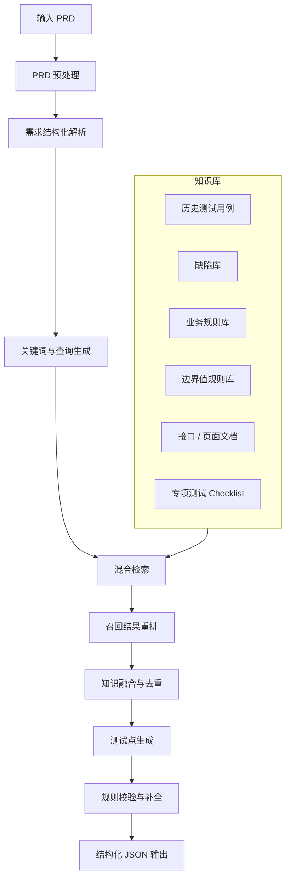

# 考题四：基于 PRD 召回知识库，生成测试点

## 1. 设计目标

给定一段 PRD 描述，测试设计 Agent 需要自动理解其中的功能点、业务规则、边界条件和异常场景，并从知识库中召回相关经验，最终生成结构化 JSON 格式的测试点。

该能力的核心不是简单让大模型直接生成测试点，而是建立一条可解释、可追溯、可评估的工程化 pipeline：

- 从 PRD 中抽取功能点、关键词、实体、规则和边界条件。
- 使用混合检索从知识库召回相关测试经验。
- 对召回结果进行去重、排序、融合和可信度评估。
- 结合 PRD 原文与知识库内容生成测试点。
- 输出结构化 JSON，便于后续进入用例生成、评审或自动化执行链路。

## 2. 工程实现概览

本题已落地为一个本地可运行的完整工程，目录为：

```text
prd-testpoint-agent-demo/
```

工程实现与方案 pipeline 一一对应：输入 PRD 文本，解析需求结构，生成检索 query，从本地模拟知识库中进行混合检索，最后输出结构化测试点 JSON。

实际工程结构如下：

```text
prd-testpoint-agent-demo/
  full_prd_testpoint_agent.py         命令行入口
  run_full_agent.ps1                  Windows 运行脚本
  README.md                           工程说明

  prd_testpoint_agent/
    config.py                         检索权重与配置
    schema.py                         数据结构定义
    text_utils.py                     文本处理与分词
    prd_parser.py                     PRD 结构化解析
    knowledge_base.py                 知识库加载
    retriever.py                      混合检索与重排
    generator.py                      测试点生成
    validator.py                      质量校验与风险发现
    pipeline.py                       完整 pipeline 编排
    cli.py                            命令行参数解析

  data/
    sample_prd.txt                    会员自动续费 PRD
    prds/                             多业务 PRD 样例
    knowledge_base.json               本地模拟知识库

  output/                             生成的测试点 JSON
```

实际工程 pipeline：

```text
PRD 文本
  -> PRD 预处理
  -> 功能点 / 实体 / 规则 / 边界 / 异常 / 关键词提取
  -> 查询生成
  -> 混合检索
     - BM25-like 关键词检索
     - token cosine 向量相似
     - 历史缺陷相似
     - 规则命中
  -> 召回结果重排
  -> 测试点生成
  -> 质量校验
  -> JSON 输出
```

已提供 PRD 样例：

| PRD 文件 | 场景 |
| --- | --- |
| `data/sample_prd.txt` | 会员自动续费 |
| `data/prds/prd_refund_flow.txt` | 订单退款 |
| `data/prds/prd_coupon_center.txt` | 优惠券领取与使用 |
| `data/prds/prd_login_risk_control.txt` | 登录风控与验证码 |
| `data/prds/prd_notification_setting.txt` | 消息通知设置 |

知识库 `data/knowledge_base.json` 已覆盖：

- 历史测试用例
- 历史缺陷
- 业务规则
- 边界值规则
- 专项测试 Checklist

实际验证结果：

| PRD 场景 | 功能点数 | 测试点数 | 知识命中数 | 风险数 |
| --- | ---: | ---: | ---: | ---: |
| 会员自动续费 | 5 | 9 | 8 | 1 |
| 订单退款 | 8 | 12 | 8 | 0 |
| 优惠券领取与使用 | 6 | 7 | 8 | 0 |
| 登录风控与验证码 | 5 | 5 | 8 | 0 |
| 消息通知设置 | 5 | 6 | 8 | 0 |

运行方式：

```powershell
cd prd-testpoint-agent-demo
powershell -ExecutionPolicy Bypass -File .\run_full_agent.ps1
```

也可以通过命令行指定 PRD 文件：

```bash
python full_prd_testpoint_agent.py --prd data/prds/prd_refund_flow.txt --kb data/knowledge_base.json --out output/refund_test_points.json --title 订单退款 --prd-id PRD_REFUND_001
```

## 3. 整体 Pipeline



## 4. Pipeline 详细设计

### 4.1 PRD 预处理

输入 PRD 可能来自文档、需求平台、Markdown、富文本或截图 OCR 结果。预处理阶段负责将 PRD 清洗为统一文本结构。

处理内容：

- 去除目录、页眉页脚、无效格式。
- 保留标题、功能说明、流程、字段表、规则说明、异常提示。
- 将表格转成结构化字段。
- 将长段落拆分为需求片段。
- 标记需求来源位置，方便测试点追溯。

输出示例：

```json
{
  "prdId": "PRD_PAY_001",
  "title": "会员自动续费功能",
  "sections": [
    {
      "sectionId": "S1",
      "title": "功能说明",
      "text": "用户可在会员购买页开启自动续费..."
    },
    {
      "sectionId": "S2",
      "title": "边界条件",
      "text": "余额不足时续费失败，并在 24 小时后重试..."
    }
  ]
}
```

### 4.2 需求结构化解析

将 PRD 内容解析为测试设计所需的结构化信息。

主要抽取对象：

| 类型 | 示例 | 用途 |
| --- | --- | --- |
| 功能点 | 开启自动续费、取消自动续费 | 生成功能测试点 |
| 业务实体 | 用户、会员、订单、支付方式 | 生成业务组合 |
| 操作行为 | 开启、关闭、扣费、重试 | 生成操作路径 |
| 状态变化 | 未开通 -> 已开通，开启 -> 关闭 | 生成状态流转测试 |
| 业务规则 | 余额不足 24 小时后重试 | 生成规则测试 |
| 边界条件 | 到期前 1 天扣费、最多重试 3 次 | 生成边界测试 |
| 异常条件 | 支付失败、网络异常、重复请求 | 生成异常测试 |
| 权限角色 | 普通用户、会员用户、过期用户 | 生成权限与角色测试 |

结构化结果示例：

```json
{
  "features": ["开启自动续费", "取消自动续费", "续费扣款", "失败重试"],
  "entities": ["用户", "会员", "订单", "支付方式"],
  "rules": [
    "会员到期前 1 天自动扣费",
    "余额不足时扣费失败",
    "失败后 24 小时重试",
    "最多重试 3 次"
  ],
  "boundaries": ["到期前 1 天", "24 小时", "3 次"],
  "exceptions": ["余额不足", "支付失败", "网络异常", "重复回调"]
}
```

### 4.3 关键词与查询生成

关键词不能只从字面抽取，还需要扩展同义词、业务别名和测试角度。

关键词类型：

- 业务关键词：自动续费、会员、扣费、订单。
- 规则关键词：到期前、重试、次数限制、状态保留。
- 异常关键词：余额不足、支付失败、回调失败、幂等。
- 测试关键词：边界值、状态流转、异常恢复、重复提交。
- 同义扩展：自动续费 -> 自动扣款、周期订阅、订阅续期。

查询生成策略：

```pseudo
queries = []

for feature in prd.features:
    queries.add(feature)
    queries.add(feature + " 测试点")
    queries.add(feature + " 历史缺陷")

for rule in prd.rules:
    queries.add(rule + " 边界")
    queries.add(rule + " 异常场景")

for exception in prd.exceptions:
    queries.add(exception + " 处理逻辑")
    queries.add(exception + " 回归用例")
```

输出示例：

```json
{
  "keywords": [
    "自动续费",
    "会员扣费",
    "余额不足",
    "失败重试",
    "最多重试 3 次",
    "支付回调幂等",
    "取消续费",
    "状态流转"
  ],
  "queries": [
    "自动续费 测试点",
    "会员扣费 历史缺陷",
    "余额不足 处理逻辑",
    "失败重试 边界",
    "支付回调幂等 回归用例"
  ]
}
```

## 5. 混合检索设计

### 5.1 检索来源

知识库建议包含：

- 历史测试用例库：同类功能的测试点和用例。
- 历史缺陷库：曾经出过问题的场景。
- 业务规则库：业务约束、状态机、权限规则。
- 边界值规则库：常见边界条件设计方法。
- 专项测试 Checklist：兼容性、性能、安全、稳定性、幂等性等。
- 接口和页面文档：字段、按钮、接口状态码、页面路径。

### 5.2 混合检索方式

单一向量检索容易召回语义相近但关键词不精确的内容；单一关键词检索容易漏掉同义表达。因此采用混合检索。

| 检索方式 | 作用 |
| --- | --- |
| BM25 / 关键词检索 | 保证关键词精确命中，例如“自动续费”“3 次” |
| 向量检索 | 召回语义相近内容，例如“订阅续期”“周期扣款” |
| 规则检索 | 命中固定规则，例如金额边界、次数边界、时间边界 |
| 缺陷相似检索 | 召回历史高风险缺陷 |

综合评分：

```pseudo
finalScore = 0.35 * bm25Score
           + 0.35 * vectorScore
           + 0.20 * defectSimilarityScore
           + 0.10 * ruleHitScore
```

### 5.3 召回结果重排

召回后需要重排，避免噪声污染测试点生成。

重排维度：

- 与 PRD 功能点是否匹配。
- 是否命中明确边界条件。
- 是否来自同业务模块。
- 是否来自高频缺陷。
- 是否有可复用的测试点。
- 是否过期或与当前规则冲突。

重排输出：

```json
[
  {
    "docId": "CASE_1001",
    "source": "历史测试用例",
    "title": "自动续费失败重试测试",
    "matchedKeywords": ["自动续费", "失败重试", "3 次"],
    "score": 0.92,
    "usableKnowledge": "失败后需要验证重试次数、重试间隔、最终状态"
  },
  {
    "docId": "BUG_2333",
    "source": "历史缺陷",
    "title": "支付回调重复导致订单重复续费",
    "matchedKeywords": ["支付回调", "幂等", "重复扣费"],
    "score": 0.88,
    "usableKnowledge": "需要验证重复回调不会生成多笔续费订单"
  }
]
```

## 6. 测试点生成策略

测试点生成时，需要同时覆盖 PRD 明确要求和知识库补充经验。

建议按以下测试类型生成：

- 功能正向测试
- 状态流转测试
- 边界值测试
- 异常测试
- 幂等测试
- 权限测试
- 数据一致性测试
- 兼容性测试
- 回归风险测试

生成规则：

- 每个功能点至少生成 1 个正向测试点。
- 每个边界条件至少生成边界内、边界点、边界外测试点。
- 每个异常条件至少生成异常触发和异常恢复测试点。
- 每条历史高频缺陷至少生成 1 个回归风险测试点。
- 每个测试点必须包含测试目标、前置条件、步骤、预期结果和来源依据。

## 7. 结构化 JSON 输出格式

```json
{
  "prdId": "string",
  "title": "string",
  "generatedAt": "string",
  "summary": {
    "featureCount": 0,
    "testPointCount": 0,
    "knowledgeHitCount": 0,
    "riskCount": 0
  },
  "keywords": [],
  "retrievedKnowledge": [],
  "testPoints": [
    {
      "id": "TP_001",
      "title": "string",
      "type": "functional | boundary | exception | state_transition | idempotency | permission | compatibility | regression_risk",
      "priority": "P0 | P1 | P2 | P3",
      "feature": "string",
      "requirementRef": {
        "sectionId": "string",
        "text": "string"
      },
      "knowledgeRefs": [
        {
          "docId": "string",
          "source": "string",
          "reason": "string"
        }
      ],
      "preconditions": [],
      "steps": [],
      "expectedResults": [],
      "testData": [],
      "tags": [],
      "confidence": 0.0
    }
  ],
  "risks": [
    {
      "type": "missing_rule | ambiguous_requirement | missing_test_data",
      "description": "string",
      "suggestion": "string"
    }
  ]
}
```

## 8. 端到端示例

### 8.1 输入 PRD

```text
功能：会员自动续费
用户可在会员购买页开启自动续费。开启后，系统在会员到期前 1 天自动扣费。
如果扣费时余额不足，则续费失败，并在 24 小时后重试，最多重试 3 次。
用户可在设置页取消自动续费。取消后不再发起自动扣费。
支付回调可能重复到达，系统需要保证不会重复生成续费订单。
```

### 8.2 Agent 提取的关键词

```json
{
  "features": ["开启自动续费", "自动扣费", "失败重试", "取消自动续费", "支付回调幂等"],
  "keywords": [
    "会员",
    "自动续费",
    "到期前 1 天",
    "余额不足",
    "24 小时后重试",
    "最多重试 3 次",
    "取消自动续费",
    "支付回调重复",
    "重复订单",
    "幂等"
  ],
  "expandedKeywords": [
    "订阅续期",
    "周期扣款",
    "自动扣款",
    "续费订单",
    "重复回调",
    "重复扣费"
  ]
}
```

### 8.3 混合检索召回结果

```json
[
  {
    "docId": "CASE_AUTO_RENEW_001",
    "source": "历史测试用例库",
    "title": "自动续费开启与取消",
    "matchedKeywords": ["自动续费", "取消自动续费"],
    "score": 0.91,
    "usableKnowledge": "需要覆盖开启后状态展示、取消后不再扣费"
  },
  {
    "docId": "BUG_PAY_087",
    "source": "历史缺陷库",
    "title": "支付回调重复导致生成两笔续费订单",
    "matchedKeywords": ["支付回调重复", "重复订单", "幂等"],
    "score": 0.89,
    "usableKnowledge": "重复回调场景必须验证订单幂等和扣费幂等"
  },
  {
    "docId": "RULE_BOUNDARY_TIME_003",
    "source": "边界值规则库",
    "title": "时间边界测试设计",
    "matchedKeywords": ["到期前 1 天", "24 小时"],
    "score": 0.84,
    "usableKnowledge": "时间类规则需要覆盖边界前、边界点、边界后"
  }
]
```

### 8.4 最终输出 JSON 测试点

```json
{
  "prdId": "PRD_MEMBER_RENEW_001",
  "title": "会员自动续费",
  "generatedAt": "2026-06-18T17:10:00+08:00",
  "summary": {
    "featureCount": 5,
    "testPointCount": 9,
    "knowledgeHitCount": 3,
    "riskCount": 1
  },
  "keywords": [
    "自动续费",
    "自动扣费",
    "到期前 1 天",
    "余额不足",
    "24 小时后重试",
    "最多重试 3 次",
    "取消自动续费",
    "支付回调重复",
    "幂等"
  ],
  "retrievedKnowledge": [
    {
      "docId": "CASE_AUTO_RENEW_001",
      "source": "历史测试用例库",
      "title": "自动续费开启与取消",
      "score": 0.91
    },
    {
      "docId": "BUG_PAY_087",
      "source": "历史缺陷库",
      "title": "支付回调重复导致生成两笔续费订单",
      "score": 0.89
    },
    {
      "docId": "RULE_BOUNDARY_TIME_003",
      "source": "边界值规则库",
      "title": "时间边界测试设计",
      "score": 0.84
    }
  ],
  "testPoints": [
    {
      "id": "TP_001",
      "title": "用户可成功开启自动续费",
      "type": "functional",
      "priority": "P0",
      "feature": "开启自动续费",
      "requirementRef": {
        "sectionId": "S1",
        "text": "用户可在会员购买页开启自动续费"
      },
      "knowledgeRefs": [
        {
          "docId": "CASE_AUTO_RENEW_001",
          "source": "历史测试用例库",
          "reason": "历史用例要求验证开启后的状态展示"
        }
      ],
      "preconditions": ["用户已登录", "用户未开启自动续费"],
      "steps": ["进入会员购买页", "开启自动续费", "确认开启结果"],
      "expectedResults": ["自动续费开启成功", "页面展示自动续费已开启", "用户订阅状态更新为已开启"],
      "testData": ["普通会员账号"],
      "tags": ["正向", "会员", "状态展示"],
      "confidence": 0.95
    },
    {
      "id": "TP_002",
      "title": "会员到期前 1 天自动扣费成功",
      "type": "boundary",
      "priority": "P0",
      "feature": "自动扣费",
      "requirementRef": {
        "sectionId": "S1",
        "text": "开启后，系统在会员到期前 1 天自动扣费"
      },
      "knowledgeRefs": [
        {
          "docId": "RULE_BOUNDARY_TIME_003",
          "source": "边界值规则库",
          "reason": "时间边界需要覆盖边界点"
        }
      ],
      "preconditions": ["用户已开启自动续费", "支付方式可用", "会员将在 1 天后到期"],
      "steps": ["构造会员到期前 1 天状态", "触发自动扣费任务", "查询扣费结果和会员有效期"],
      "expectedResults": ["扣费成功", "生成一笔续费订单", "会员有效期正确延长"],
      "testData": ["余额充足账号", "到期前 1 天会员"],
      "tags": ["边界值", "自动扣费", "订单"],
      "confidence": 0.93
    },
    {
      "id": "TP_003",
      "title": "未到扣费时间不应提前扣费",
      "type": "boundary",
      "priority": "P1",
      "feature": "自动扣费",
      "requirementRef": {
        "sectionId": "S1",
        "text": "系统在会员到期前 1 天自动扣费"
      },
      "knowledgeRefs": [
        {
          "docId": "RULE_BOUNDARY_TIME_003",
          "source": "边界值规则库",
          "reason": "时间边界需要覆盖边界前"
        }
      ],
      "preconditions": ["用户已开启自动续费", "会员将在 2 天后到期"],
      "steps": ["构造会员到期前 2 天状态", "触发自动扣费任务", "查询订单和扣费记录"],
      "expectedResults": ["系统不发起自动扣费", "不生成续费订单", "会员有效期不变化"],
      "testData": ["到期前 2 天会员"],
      "tags": ["边界值", "防提前扣费"],
      "confidence": 0.9
    },
    {
      "id": "TP_004",
      "title": "余额不足时续费失败并记录失败状态",
      "type": "exception",
      "priority": "P0",
      "feature": "失败重试",
      "requirementRef": {
        "sectionId": "S2",
        "text": "如果扣费时余额不足，则续费失败"
      },
      "knowledgeRefs": [],
      "preconditions": ["用户已开启自动续费", "会员到期前 1 天", "账户余额不足"],
      "steps": ["触发自动扣费任务", "查询扣费结果", "查询会员状态"],
      "expectedResults": ["扣费失败", "不延长会员有效期", "记录失败原因余额不足", "生成待重试记录"],
      "testData": ["余额不足账号"],
      "tags": ["异常", "余额不足", "失败状态"],
      "confidence": 0.94
    },
    {
      "id": "TP_005",
      "title": "扣费失败后 24 小时触发重试",
      "type": "boundary",
      "priority": "P0",
      "feature": "失败重试",
      "requirementRef": {
        "sectionId": "S2",
        "text": "并在 24 小时后重试"
      },
      "knowledgeRefs": [
        {
          "docId": "CASE_AUTO_RENEW_001",
          "source": "历史测试用例库",
          "reason": "历史用例覆盖失败后的重试流程"
        }
      ],
      "preconditions": ["用户自动续费扣费失败", "存在待重试记录"],
      "steps": ["构造失败后未满 24 小时状态", "验证不会重试", "构造失败后满 24 小时状态", "触发重试任务"],
      "expectedResults": ["未满 24 小时时不重试", "满 24 小时后发起重试", "重试结果被正确记录"],
      "testData": ["扣费失败记录", "时间模拟能力"],
      "tags": ["边界值", "24小时", "重试"],
      "confidence": 0.91
    },
    {
      "id": "TP_006",
      "title": "最多只重试 3 次",
      "type": "boundary",
      "priority": "P0",
      "feature": "失败重试",
      "requirementRef": {
        "sectionId": "S2",
        "text": "最多重试 3 次"
      },
      "knowledgeRefs": [],
      "preconditions": ["用户自动续费连续失败", "存在重试记录"],
      "steps": ["构造第 1 次失败并触发重试", "构造第 2 次失败并触发重试", "构造第 3 次失败并触发重试", "继续推进时间并再次触发重试任务"],
      "expectedResults": ["系统最多发起 3 次重试", "第 4 次不再发起扣费", "最终状态标记为续费失败"],
      "testData": ["连续扣费失败账号"],
      "tags": ["边界值", "次数限制", "重试上限"],
      "confidence": 0.92
    },
    {
      "id": "TP_007",
      "title": "用户取消自动续费后不再自动扣费",
      "type": "functional",
      "priority": "P0",
      "feature": "取消自动续费",
      "requirementRef": {
        "sectionId": "S3",
        "text": "用户可在设置页取消自动续费。取消后不再发起自动扣费"
      },
      "knowledgeRefs": [
        {
          "docId": "CASE_AUTO_RENEW_001",
          "source": "历史测试用例库",
          "reason": "历史用例要求覆盖取消后的扣费抑制"
        }
      ],
      "preconditions": ["用户已开启自动续费"],
      "steps": ["进入设置页", "取消自动续费", "构造会员到期前 1 天状态", "触发自动扣费任务"],
      "expectedResults": ["自动续费状态为已关闭", "系统不发起扣费", "不生成续费订单"],
      "testData": ["已开启自动续费账号"],
      "tags": ["取消", "防扣费", "状态流转"],
      "confidence": 0.96
    },
    {
      "id": "TP_008",
      "title": "重复支付回调不会生成重复续费订单",
      "type": "idempotency",
      "priority": "P0",
      "feature": "支付回调幂等",
      "requirementRef": {
        "sectionId": "S4",
        "text": "支付回调可能重复到达，系统需要保证不会重复生成续费订单"
      },
      "knowledgeRefs": [
        {
          "docId": "BUG_PAY_087",
          "source": "历史缺陷库",
          "reason": "历史缺陷曾出现重复回调导致重复订单"
        }
      ],
      "preconditions": ["用户自动续费扣费成功", "存在同一支付流水号"],
      "steps": ["模拟支付成功回调", "再次发送相同支付流水号的回调", "查询续费订单和扣费记录"],
      "expectedResults": ["只生成一笔续费订单", "只延长一次会员有效期", "重复回调返回幂等成功或已处理"],
      "testData": ["相同支付流水号", "支付回调模拟器"],
      "tags": ["幂等", "重复回调", "历史缺陷"],
      "confidence": 0.97
    },
    {
      "id": "TP_009",
      "title": "自动续费状态流转正确",
      "type": "state_transition",
      "priority": "P1",
      "feature": "自动续费状态",
      "requirementRef": {
        "sectionId": "S1-S3",
        "text": "用户可开启和取消自动续费"
      },
      "knowledgeRefs": [],
      "preconditions": ["用户已登录"],
      "steps": ["从未开启状态开启自动续费", "验证状态变为已开启", "取消自动续费", "验证状态变为已关闭", "重新进入页面验证状态保留"],
      "expectedResults": ["状态按未开启 -> 已开启 -> 已关闭流转", "页面展示与后台状态一致", "重新进入页面后状态保持正确"],
      "testData": ["普通会员账号"],
      "tags": ["状态流转", "前后端一致性"],
      "confidence": 0.89
    }
  ],
  "risks": [
    {
      "type": "missing_rule",
      "description": "PRD 未明确重试 3 次全部失败后是否通知用户",
      "suggestion": "建议补充最终失败后的用户通知、状态展示和消息触达规则"
    }
  ]
}
```

## 9. 核心伪代码

```pseudo
function generateTestPointsFromPRD(prdText, knowledgeBase):
    cleanPRD = preprocessPRD(prdText)

    requirementModel = parseRequirement(cleanPRD)
    keywords = extractKeywords(requirementModel)
    expandedKeywords = expandKeywords(keywords)
    queries = buildQueries(requirementModel, keywords, expandedKeywords)

    retrievedDocs = []
    for query in queries:
        bm25Docs = knowledgeBase.keywordSearch(query)
        vectorDocs = knowledgeBase.vectorSearch(query)
        ruleDocs = knowledgeBase.ruleSearch(query, requirementModel.boundaries)
        defectDocs = knowledgeBase.defectSimilaritySearch(query)

        mergedDocs = mergeByDocId(bm25Docs, vectorDocs, ruleDocs, defectDocs)
        scoredDocs = scoreDocs(mergedDocs)
        retrievedDocs.add(scoredDocs)

    topKnowledge = rerankAndDeduplicate(retrievedDocs, requirementModel)
    knowledgeSummary = extractUsableKnowledge(topKnowledge)

    testPoints = []
    for feature in requirementModel.features:
        testPoints.add(generateFunctionalTestPoint(feature, requirementModel, knowledgeSummary))

    for boundary in requirementModel.boundaries:
        testPoints.addAll(generateBoundaryTestPoints(boundary, requirementModel, knowledgeSummary))

    for exception in requirementModel.exceptions:
        testPoints.add(generateExceptionTestPoint(exception, requirementModel, knowledgeSummary))

    for defectKnowledge in topKnowledge.where(source == "历史缺陷库"):
        testPoints.add(generateRegressionRiskTestPoint(defectKnowledge, requirementModel))

    testPoints = deduplicateTestPoints(testPoints)
    testPoints = assignPriority(testPoints)
    testPoints = validateAndComplete(testPoints, requirementModel)

    return buildJsonOutput(
        prd = cleanPRD,
        keywords = keywords,
        retrievedKnowledge = topKnowledge,
        testPoints = testPoints,
        risks = findRequirementRisks(requirementModel)
    )
```

## 10. 质量控制

为了避免生成结果“看起来很多、实际不可用”，需要增加质量控制。

### 10.1 完整性检查

- PRD 中每个功能点至少有一个测试点。
- 每个边界条件至少覆盖边界前、边界点、边界后。
- 每个异常条件至少有触发、结果、恢复校验。
- 每个高相似历史缺陷至少有对应回归风险测试点。

### 10.2 可追溯检查

- 每个测试点必须关联 PRD 原文片段。
- 知识库增强的测试点必须关联知识来源。
- 若测试点来自推断，需要标记 confidence。

### 10.3 去重与冲突检查

- 合并语义重复测试点。
- 检查测试点预期结果是否与 PRD 冲突。
- 对 PRD 缺失或矛盾的规则输出 risks，而不是强行编造。

## 11. 总结

基于 PRD 召回知识库生成测试点的关键，是把大模型生成能力放进可控 pipeline 中：

- 先结构化理解 PRD。
- 再抽取关键词和扩展查询。
- 通过 BM25、向量检索、规则检索、缺陷相似检索做混合召回。
- 对召回知识进行重排、融合和去噪。
- 最终输出可追溯、可评审、可继续加工的 JSON 测试点。

这样生成的测试点既覆盖 PRD 明确需求，也能吸收历史缺陷、边界规则和专项测试经验，适合进入后续测试用例生成、自动化编排和评审流程。
